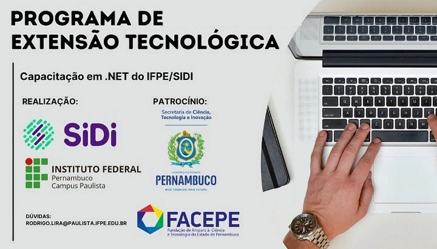

<h1 align="center">
  
</h1>

<h1 align="center">Technological Extension Course: Training in .NET </h1>

## Project description

C# (pronounced "See Sharp") is a modern, object-oriented, and type-safe programming language. C# enables developers to build many types of secure and robust applications that run in .NET. C# has its roots in the C family of languages and will be immediately familiar to C, C++, Java, and JavaScript programmers. This tour provides an overview of the major components of the language in C# 8 and earlier.

The extension course is offered by the Federal Institute of Pernambuco in partnership with the company SiDi, will be coordinated by professor Rodrigo Lira and taught remotely focused on the .NET platform. The course will begin with the basics of the programming language and continue with an introduction to creating applications using Windows Presentation Foundation (WPF). Throughout the course, good coding practices (clean code) and knowledge of the Git versioning system will also be presented.

### 🛠 Technologies

The following tools were used in the construction of the project:

- [Visual Studio 2022 Preview Community Edition](https://visualstudio.microsoft.com/pt-br/vs/preview/)
- [C#](https://docs.microsoft.com/pt-br/dotnet/csharp/)
- [.NET](https://docs.microsoft.com/pt-br/dotnet/core/whats-new/dotnet-core-3-1)
